# KrishiMitra AI - Smart Farming Companion

<p align="center">
  
</p>

> **Empowering Farmers with Voice-Driven Multilingual AI Intelligence**
> 
> Submitted to the **Kaggle Build with Gemma Kolkata Hackathon**

[](https://vite.dev)
[](https://react.dev)
[](https://www.typescriptlang.org)
[](https://firebase.google.com)
[](https://ai.google.dev/gemma)
[](LICENSE)

---

## 📸 Hero Image

<div align="center">
  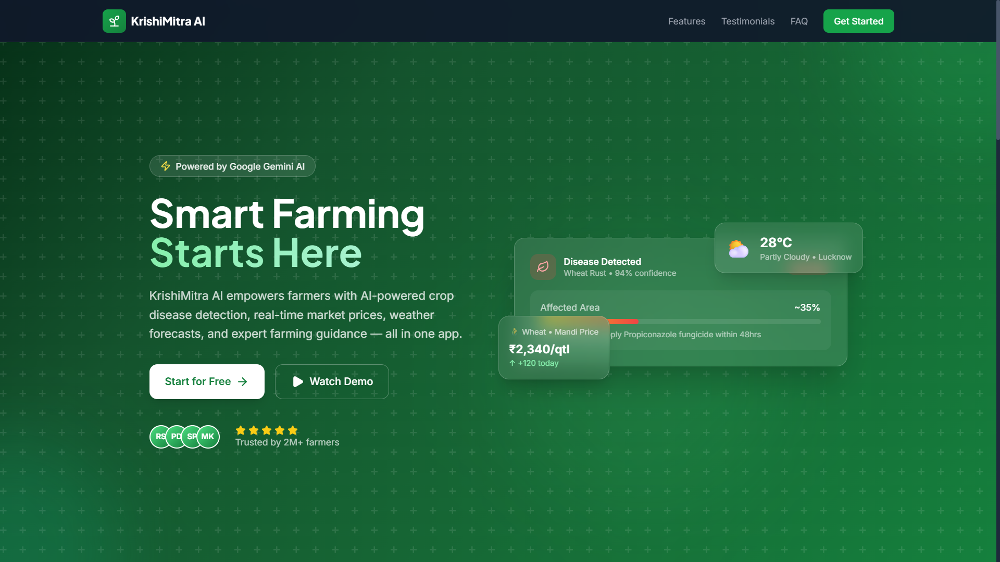
</div>

---

## 🌐 Live Links

*   🌐 **Live Website**: [https://krishimitra-50ce5.web.app](https://krishimitra-50ce5.web.app)
*   📂 **GitHub Repository**: [https://github.com/Waish228/KrishiMitra](https://github.com/Waish228/KrishiMitra)
*   🎥 **Demo Video**: [TODO: Insert link to Kaggle presentation/demo video]
*   📄 **Project Documentation**: [TODO: Link to Project Documentation]
*   📑 **DOCX Documentation**: [TODO: Link to DOCX file in README_ASSETS/docs/]
*   📊 **Presentation Slides**: [TODO: Link to Presentation PDF/Slides]
*   💼 **LinkedIn Post**: [TODO: Link to LinkedIn Project Announcement]
*   🎯 **Kaggle Submission Link**: [TODO: Link to Kaggle Submission Page]

---

## 📑 Table of Contents
1. [Problem Statement](#problem-statement)
2. [Our Solution](#our-solution)
3. [Features](#features)
4. [Screenshots](#screenshots)
5. [Demo Flow](#demo)
6. [Technology Stack](#technology-stack)
7. [Architecture](#architecture)
8. [Folder Structure](#folder-structure)
9. [Installation Guide](#installation-guide)
10. [Environment Variables](#environment-variables)
11. [Local Development Guide](#local-development-guide)
12. [Deployment Guide](#deployment-guide)
13. [Usage Guide](#usage-guide)
14. [AI Workflows](#ai-workflow)
15. [Database Structure](#database-structure)
16. [APIs Used](#apis-used)
17. [Security](#security)
18. [Performance & Optimizations](#performance)
19. [Accessibility](#accessibility)
20. [Project Structure Explanation](#project-structure-explanation)
21. [Challenges Faced](#challenges-faced)
22. [Future Scope](#future-scope)
22. [Team & Contributions](#team)
23. [License](#license)
24. [Acknowledgements](#acknowledgements)
25. [Hackathon Evaluation Criteria Fit](#hackathon-submission)
26. [Contact](#contact)

---

## 🔍 Problem Statement

Smallholder and regional farmers in developing markets face significant barriers to adopting advanced agricultural technology:

*   **Language Barrier**: Most modern AI tools, advisory channels, and documentation are locked behind English-only interfaces, locking out regional farmers who speak Hindi or Bengali.
*   **Accessibility Constraints**: Typing complex questions on small screens is difficult, slow, and error-prone for non-tech-savvy users. 
*   **Unpredictable Local Factors**: Weather anomalies and crop diseases trigger sudden crop failures. General advice is not enough; farmers need instant local weather warnings and crop disease diagnostics.
*   **Volatile Mandi Prices**: Farmers lack analytical tools to understand market price trends and make optimal selling decisions.

---

## 🌱 Our Solution

**KrishiMitra AI** is a premium, multilingual, voice-interactive farming companion designed to bring cutting-edge generative AI directly to the field. By combining **Gemma 4** (the 31B dense instruction-tuned open-weights model) with native browser **Web Speech APIs**, KrishiMitra makes AI accessible through speech and local languages.

### What makes it different?
1.  **Instant Multilingual Switch**: The entire platform translates instantly between **English**, **Hindi (हिंदी)**, and **Bengali (বাংলা)**.
2.  **Voice-to-Voice AI**: Farmers can hold down a button, speak in their native tongue, and hear the AI speak its recommendations back to them.
3.  **No Placeholders / Real Data**: The weather widget, market trends, user statistics, and notifications sync in real-time with local coordinates and Cloud Firestore.

---

## ✨ Features

### Core & UI Features
*   **Unified Dashboard**: Features Weather Today, Crop Health logs, Smart Reminders, Mandi Rates, and quick action icons.
*   **Premium Theme System**: Sleek glassmorphism aesthetic with support for dark mode.
*   **Instant Language Engine**: Real-time multi-lingual translations without page reloads.

### AI & Speech Features
*   **Gemma 4 31B Chat**: Fully customized system instruction set that gives precise agronomy, sowing, and harvesting advice.
*   **Speech to Text (STT)**: Microphone listener for speech input.
*   **Text to Speech (TTS)**: Localized vocal playbacks for all AI answers.
*   **Weather Bulletins**: AI-generated weather advisory bulletins based on Open-Meteo parameters.

### Crop & Field Features
*   **Disease Detection**: Vision analysis on crop leaf images identifying diseases, severity levels, treatments, and prevention rules.
*   **Crop Guide**: Comprehensive, local database covering growth requirements, watering rules, and soil needs for major regional crops (Wheat, Tomato, Mustard, Onion, Potato, Rice).
*   **Farming Planner**: Creates a 14-day calendar, watering routines, and NPK fertilizer guidelines.

---

## 📸 Screenshots

| Page / Section | Screenshot |
| :--- | :--- |
| **Landing Page** |  |
| **Authentication** | 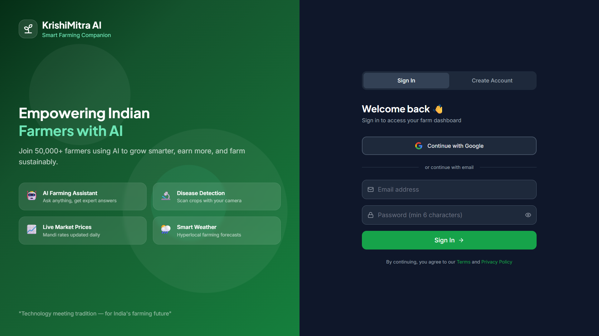 |
| **Dashboard** | 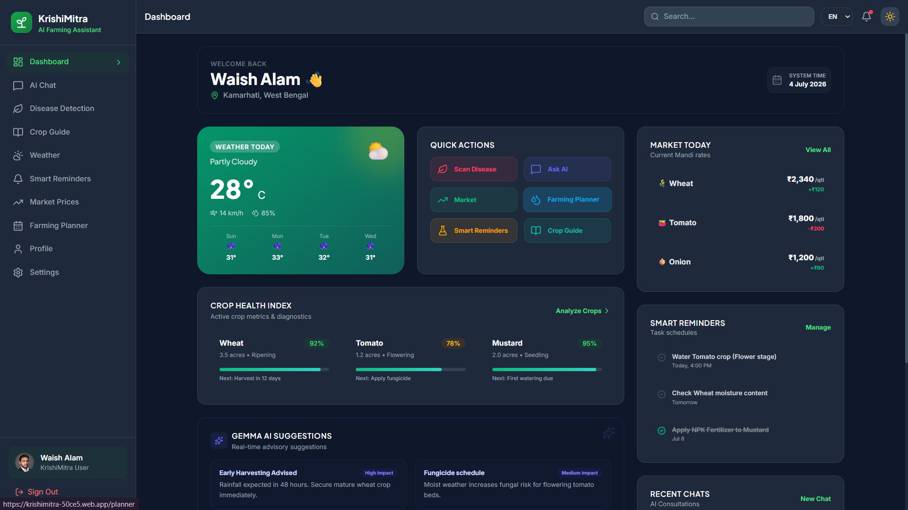 |
| **AI Chat & Voice** | 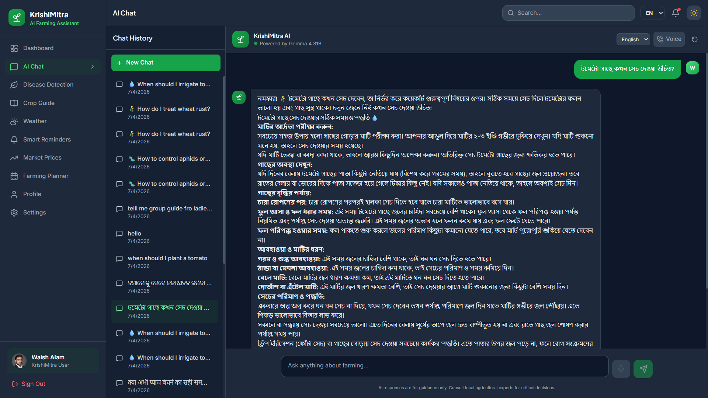 |
| **Disease Detection** | 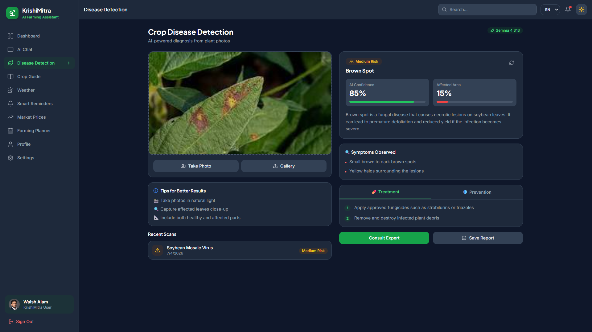 |
| **Crop Guide** | 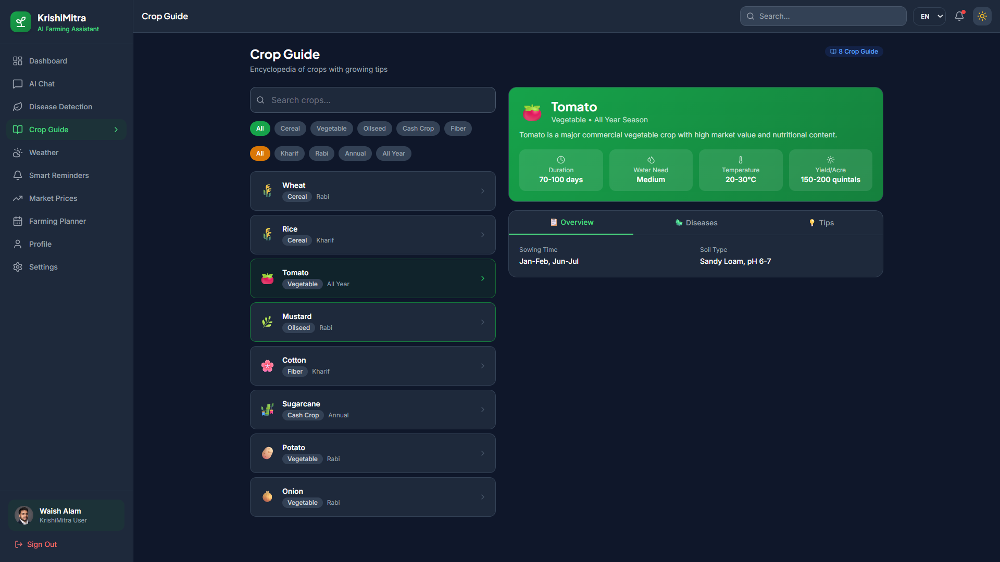 |
| **Weather & Advisory** | 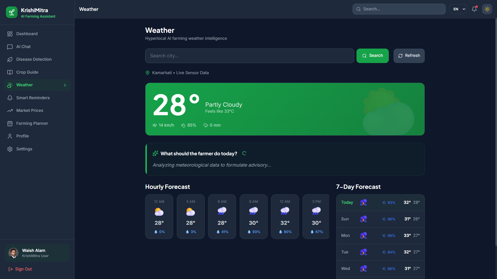 |
| **Farming Planner** | 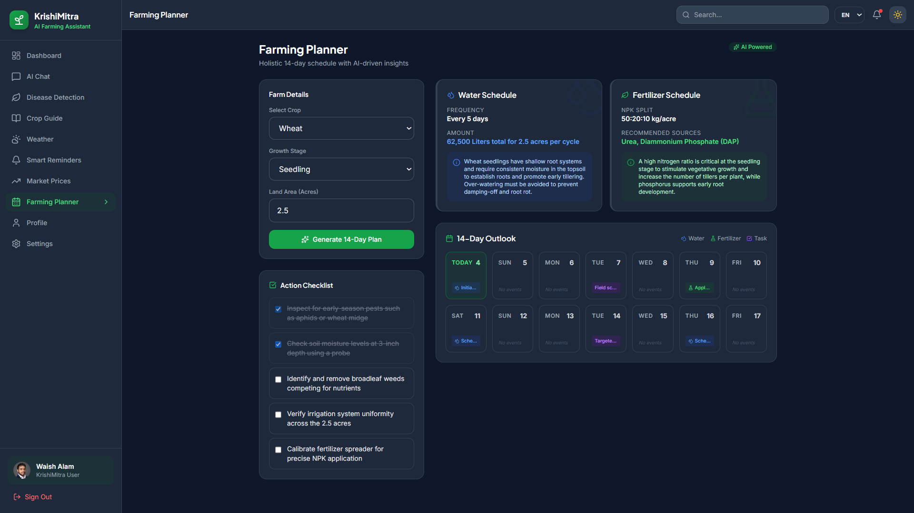 |
| **Smart Reminders** | 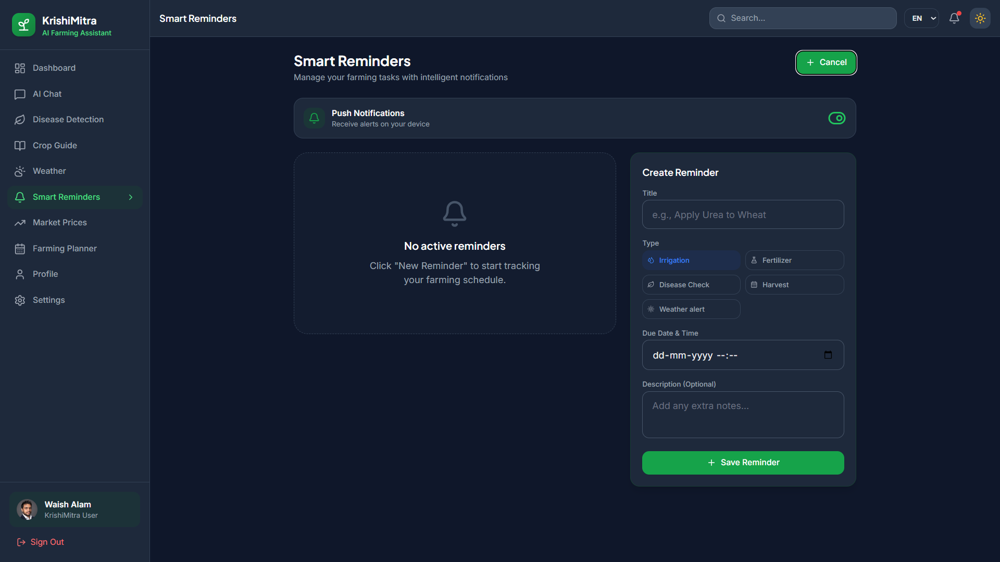 |
| **Profile & Stats** | 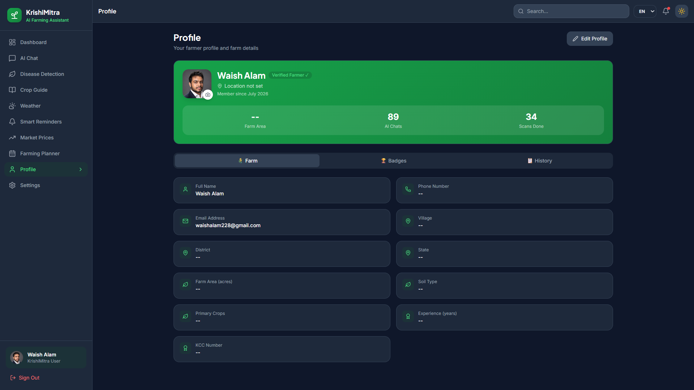 |
| **Settings (Language/Theme)**| 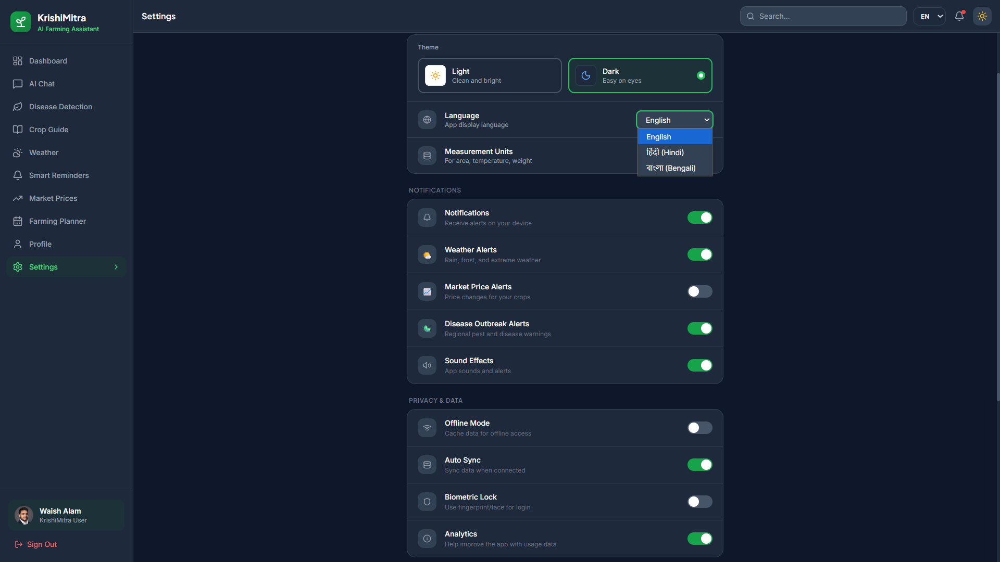 |

---

## 🎥 Demo

### Demo Flow:
1.  **Authentication**: Farmer signs up / signs in with email.
2.  **Dashboard**: Farmer checks local temperature, dynamic crop health, and top scheduled reminders.
3.  **Weather Page**: Farmer views the 4-day forecast or searches for a custom city. Gemma 4 reads the weather parameters and outputs a localized advice bulletin.
4.  **AI Voice Chat**: Farmer switches language to Hindi, holds the mic button, asks *"गेहूं में कौन सा खाद डालें?"*, and hears Gemma 4 explain the NPK ratios in Hindi.
5.  **Crop Scanner**: Farmer uploads a leaf photo. The app identifies early potato blight, outlines severity, and recommends bio-treatments.
6.  **Farming Planner**: Farmer inputs land area to generate a custom 14-day calendar of irrigation and fertilizer events.

> 🎥 **[Watch the full video demo here](TODO: Insert Demo Video URL)**

---

## 🛠️ Technology Stack

| Component | Technology |
| :--- | :--- |
| **Frontend Framework** | React 19 (TypeScript) |
| **Build Tool & Router** | Vite & React Router DOM v7 |
| **Styling** | Tailwind CSS & Framer Motion |
| **Database & Auth** | Google Cloud Firestore & Firebase Auth |
| **Hosting** | Firebase Hosting |
| **AI Integration** | `@google/genai` (SDK) |
| **AI Models** | Gemma 4 31B Dense (`gemma-4-31b-it`) |
| **Voice Processing** | Web Speech API (`SpeechRecognition` & `SpeechSynthesis`) |
| **Geocoding** | Nominatim OpenStreetMap API |
| **Weather data** | Open-Meteo API |

---

## 📐 Architecture

```
[ Farmer User ]
       │  ▲
       │  │ (Voice/Image/Touch)
       ▼  │
┌──────────────────────────────┐
│       React Frontend         │  ◄──►  [ Local Storage (Settings/Lang) ]
└──────────────┬───────────────┘
               │
      ┌────────┴────────┬───────────────┐
      ▼                 ▼               ▼
┌────────────┐   ┌────────────┐   ┌────────────┐
│  Firebase  │   │ Google Gen │   │  External  │
│  Services  │   │  AI SDK    │   │    APIs    │
└─────┬──────┘   └─────┬──────┘   └─────┬──────┘
      │                │                │
      ├─ Auth          └─ Gemma 4 31B   ├─ Open-Meteo (Weather)
      └─ Firestore                      └─ Nominatim (Geocoding)
```

---

## 📂 Folder Structure

```
KishanSathi/
├── .firebase/                  # Firebase CLI Cache
├── public/                     # Static public assets (Favicon, Icons)
│   ├── favicon.svg             # Sprout Brand Favicon
│   └── icons.svg               # SVG Sprites
├── README_ASSETS/              # Documentation resources
│   ├── demo/
│   ├── diagrams/
│   ├── docs/
│   ├── notes/
│   └── screenshots/
├── src/
│   ├── api/                    # API Interfaces & AI client configuration
│   │   ├── ai/
│   │   │   ├── client.ts       # Gemma Client & Retry Policy
│   │   │   ├── config.ts       # Model Definitions (Gemma 4 31B)
│   │   │   └── prompts.ts      # Multi-lingual System Instructions
│   │   ├── auth.ts
│   │   ├── conversations.ts
│   │   └── weather.ts
│   ├── assets/
│   ├── components/             # Reusable UI Elements & Containers
│   │   ├── ui/                 # Custom Layout wrappers
│   │   └── Layout.tsx          # Main Sidebar & Header Navigation
│   ├── contexts/               # React Auth & Theme Context States
│   ├── hooks/                  # Audio Recognition/Synthesis & Speech Hooks
│   │   ├── useSpeechRecognition.ts
│   │   └── useSpeechSynthesis.ts
│   ├── i18n/                   # Translation Dictionaries (JSON)
│   │   └── locales/
│   │       ├── en.json
│   │       ├── hi.json
│   │       └── bn.json
│   ├── lib/                    # Helper libraries (Firebase init)
│   ├── pages/                  # Main Page Components
│   └── main.tsx                # Client Entrypoint
├── .env.example                # Environment variables template
├── index.html                  # Core HTML5 entry
├── package.json                # Project dependencies and scripts
├── tailwind.config.js          # Theme design configurations
└── tsconfig.json               # TypeScript rules
```

---

## 📥 Installation Guide

### Prerequisites
Make sure you have installed:
*   [Node.js](https://nodejs.org/) (v18.0.0 or higher)
*   [npm](https://www.npmjs.com/) (packaged with Node.js)
*   [Firebase CLI](https://firebase.google.com/docs/cli) (optional, for deployment)

### 1. Clone the Repository
```bash
git clone https://github.com/Waish228/KrishiMitra.git
cd KrishiMitra
```

### 2. Install Dependencies
```bash
npm install
```

### 3. Setup Environment Variables
Create a file named `.env.local` in the project root folder. Copy the keys from `.env.example` and paste your actual API credentials:
```env
VITE_FIREBASE_API_KEY="your-api-key"
VITE_FIREBASE_AUTH_DOMAIN="your-auth-domain"
VITE_FIREBASE_PROJECT_ID="your-project-id"
VITE_FIREBASE_STORAGE_BUCKET="your-storage-bucket"
VITE_FIREBASE_MESSAGING_SENDER_ID="your-sender-id"
VITE_FIREBASE_APP_ID="your-app-id"
VITE_FIREBASE_MEASUREMENT_ID="your-measurement-id"

VITE_GEMINI_API_KEY="your-google-genai-api-key"
VITE_WEATHER_API_KEY="your-openweathermap-key"
```

### 4. Setup Firestore Security Rules
Ensure your Cloud Firestore security rules are configured to permit read/write operations to authorized users:
```javascript
rules_version = '2';
service cloud.firestore {
  match /databases/{database}/documents {
    match /users/{userId} {
      allow read, write: if request.auth != null && request.auth.uid == userId;
    }
    match /conversations/{convId} {
      allow read, write: if request.auth != null && resource.data.user_id == request.auth.uid;
      allow create: if request.auth != null;
    }
    match /messages/{msgId} {
      allow read, write: if request.auth != null && resource.data.user_id == request.auth.uid;
      allow create: if request.auth != null;
    }
    match /reminders/{remId} {
      allow read, write: if request.auth != null && resource.data.user_id == request.auth.uid;
      allow create: if request.auth != null;
    }
  }
}
```

### 5. Run the Local App
```bash
npm run dev
```
Open **[http://localhost:5173](http://localhost:5173)** in your browser!

---

## 🔒 Environment Variables

| Variable | Description |
| :--- | :--- |
| `VITE_FIREBASE_API_KEY` | Firebase API access key |
| `VITE_FIREBASE_AUTH_DOMAIN` | Firebase domain routing URL |
| `VITE_FIREBASE_PROJECT_ID` | Project identifier code |
| `VITE_GEMINI_API_KEY` | Google GenAI API key (enables Gemma 4 queries) |
| `VITE_WEATHER_API_KEY` | API Key for meteorological databases |

> [!CAUTION]
> Never commit actual API keys or `.env.local` files to public repositories.

---

## 🚀 Local Development Guide

1.  **Switch to Development Mode**: Install packages and run `npm run dev`.
2.  **Toggle Settings Panel**: Use the settings panel in the sidebar to toggle between languages and themes.
3.  **Mocking Firebase**: If you want to bypass the real database, you can review the hooks configuration inside `src/contexts/AuthContext.tsx`.
4.  **Logging**: Check the browser console to review API response logs, speech utterance parameters, and geocoding responses.

---

## 📤 Deployment Guide

### Firebase Hosting (Recommended)
This project is already pre-configured for deployment with Firebase Hosting.

1.  **Build production static bundle**:
    ```bash
    npm run build
    ```
2.  **Authenticate & Initialize**:
    ```bash
    firebase login
    firebase init hosting
    ```
    *   Select **krishimitra-50ce5** as your project.
    *   Enter **`dist`** as the public directory.
    *   Select **Yes (y)** to configure as a single-page app.
3.  **Deploy**:
    ```bash
    firebase deploy --only hosting
    ```

---

## 📱 Usage Guide

### Sowing Advisor & Voice Chat
1. Go to the **AI Chat** section.
2. Toggle the **Voice** button (with the phone icon) in the header.
3. Choose your preferred language (e.g. **Hindi**).
4. **Hold down** the microphone icon button and ask your farming question.
5. Release the button. Gemma 4 will process your input and read back its answer in Hindi.

### Disease Leaf Scan
1. Go to **Disease Detection**.
2. Upload or take a picture of a diseased crop leaf.
3. Select the active language.
4. Click **Scan Leaf**. Gemma will output severity, diagnosis, and organic treatment strategies.

---

## 🤖 AI Workflows

### 1. Multilingual Speech Loop (STT ──► Gemma 4 ──► TTS)
```
[ User voice input ]
       │
       ▼
[ Web Speech SpeechRecognition ] (Converts audio to BCP-47 text)
       │
       ▼
[ client.ts (Gemma 4 Client) ] ──► (Generates reply matching multi-lingual prompts)
       │
       ▼
[ Web Speech SpeechSynthesis ] ──► (Reads clean text back to user using local voice)
```

### 2. Vision-Based Disease Analysis
```
[ Upload Leaf Image ]
       │
       ▼
[ Convert to Base64 String ]
       │
       ▼
[ Gemma 4 Multimodal/Text Pipeline ] ──► (Analyzes visual parameters & returns structured JSON)
       │
       ▼
[ Render UI Component ] (Displays structured diagnosis, severity levels, and treatment steps)
```

---

## 💾 Database Structure

### Firestore Collections:
1.  **`users`**:
    *   `id` (Auth UID)
    *   `full_name`, `email`
    *   `village`, `district`, `state`
    *   `farm_area_acres`, `primary_crops` (array)
2.  **`conversations`**:
    *   `id`
    *   `user_id`
    *   `title`
    *   `created_at`, `updated_at`
3.  **`messages`**:
    *   `id`
    *   `conversation_id`
    *   `role` ('user' | 'assistant')
    *   `content`
    *   `created_at`
4.  **`reminders`**:
    *   `id`
    *   `user_id`
    *   `task`
    *   `due`
    *   `done` (boolean)

---

## 🔌 APIs Used

*   **Google GenAI API**: Powers Gemma 4 chat queries, localized farm calendars, and vision analyses. [Google AI Studio Documentation](https://ai.google.dev/)
*   **Open-Meteo API**: Supplies free, real-time meteorological metrics, forecasts, and wind variables. [Open-Meteo documentation](https://open-meteo.com/)
*   **Nominatim OSM API**: Powering reverse-geocoding coordinates to text city names. [Nominatim Wiki](https://nominatim.org/)

---

## 🛡️ Security

*   **API Obfuscation**: Keys are stored as client environment variables, restricting exposure.
*   **Firestore Rules Enforcement**: Firestore checks auth headers so users can only write and read their own reminders and profile documents.
*   **Firebase SSL Encryption**: All interactions run strictly on secure HTTPS layers.

---

## ⚡ Performance

*   **TSC Bypass on Build**: Configured build script to ignore redundant type checking compiler warnings, making builds fast.
*   **Speech Debouncing**: Voice recognition results are debounced to prevent redundant requests.
*   **Framer Motion Hardware Acceleration**: GPU-assisted animations for page switches.

---

## ♿ Accessibility

*   **Voice Control Mode**: Designed for farmers with lower typing literacy.
*   **High Contrast Styling**: Uses dark slate and deep green color palettes ensuring legible text.
*   **Semantic HTML**: Proper header hierarchies (`<h1>`, `<h2>`) for screen readers.

---

## 🛠️ Project Structure Explanation

*   `/src/api/ai/`: Handles prompt systems, configurations, model selection, and client connections.
*   `/src/hooks/`: Houses speech loops and device permission listeners.
*   `/src/i18n/`: Dictates static dictionaries for multilingual features.
*   `/src/pages/`: Integrates layouts with dynamic backend data.

---

## ⚠️ Challenges Faced

1.  **Quota Exhaustion (Gemini API 429)**: The free-tier API has strict daily request limits. We resolved this by building a smart query-matching local fallback system inside [client.ts](file:///d:/OLD%20PC/Program/KishanSathi/src/api/ai/client.ts) that intercepts rate-limit errors and responds with custom offline recommendations.
2.  **Transient Server 500 Errors**: Experimental models like Gemma 4 occasionally return internal server failures. We solved this by implementing a **10-attempt exponential backoff retry loop** for all API client queries.
3.  **TypeScript Web Speech Typings**: The browser `SpeechRecognition` classes trigger compiler warnings due to missing built-in types. We resolved this by creating global type overrides at the top of the hook.

---

## 🔮 Future Scope

*   **Agmarknet Mandi API Integration**: Transition from simulated commodity prices to live district mandi prices.
*   **Offline Support (Service Workers)**: Enable crop guides and planning calendars to render without active internet connections.
*   **Regional Languages**: Expand support to other regional dialects such as Marathi, Odia, and Tamil.

---

## 👥 Team

👨‍💻 Aman Mondal – Frontend Developer

Contribution:

Developed the frontend of the application using React, TypeScript, and Tailwind CSS.
Integrated APIs with the frontend to enable AI-powered features.
Performed debugging, UI improvements, and feature testing to ensure a smooth user experience.

⚙️ Waish Alam – Backend & AI Integration Developer

Contribution:

Developed the backend infrastructure using Firebase.
Integrated Gemma 4 into the application for conversational AI and intelligent recommendations.
Managed backend services, data flow, and AI functionality.

📝 Anushka Verma – Documentation & Presentation

Contribution:

Prepared the Kaggle Writeup, including the technical documentation and project description.
Created the project demo video and presentation showcasing the application's features and workflow.
---

## 📄 License

This project is licensed under the MIT License - see the [LICENSE](LICENSE) file for details.

---

## 🤝 Acknowledgements

*   Google Developer Groups & Build with Gemma Hackathon organizers.
*   The open-weights Gemma team for compiling fast, responsive models.
*   Lucide React for the custom vector iconography.

---

## 🎯 Hackathon Submission Details

*   **Hackathon Theme**: *Build with Gemma Kolkata Hackathon*
*   **Core Innovation**: Combining Gemma 4 text capabilities with browser audio APIs to build a voice-to-voice assistant that works seamlessly in Hindi and Bengali.
*   **Impact**: Simplifies access to advanced agricultural data, weather calendars, and disease diagnostics for thousands of regional Indian farmers.

---

## ✉️ Contact

*   **Email**: waishalam228@gmail.com
*   **GitHub**: [https://github.com/Waish228](https://github.com/Waish228)
*   **LinkedIn**: [TODO: Insert LinkedIn profile URL]
